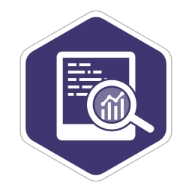
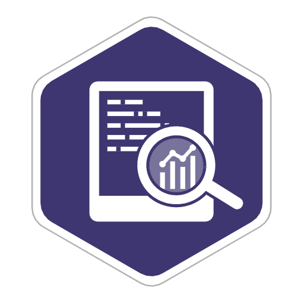

# How the favicons were created

First the SVG file `logo.svg` was created with `logo.R`. Then the full set of favicons was created by uploading the SVG file to the following website: https://favicon.io/svg-favicon/.

`favicon.ico` at 16x16: 

`favicon.ico` at 32x32: 

`apple-touch-icon.png` at 180x180: 

`android-chrome-192x192.png` at 192x192: 

`android-chrome-512x512.png` at 512x512: 

